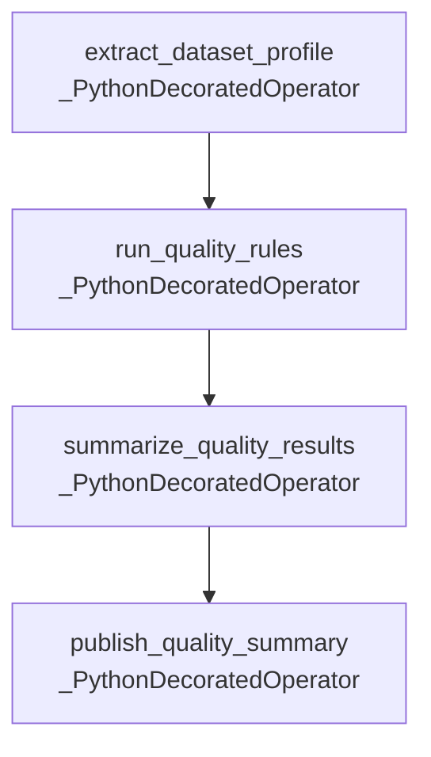

# DAG Documentation — `daily_data_quality_checks`

Generated at `2026-08-19T09:50:48+00:00` from `dags/daily_data_quality_checks.py`.

## `daily_data_quality_checks`

No description provided.

| Property | Value |
| --- | --- |
| Schedule | `0 0 * * *` |
| Start date | `2026-08-01T00:00:00+00:00` |
| End date | `Not set` |
| Catchup | `False` |
| Max active runs | `16` |
| Owner | `data-quality-team` |
| Tags | `daily`, `data-quality`, `example` |
| Task count | `4` |

### Task Graph

### Tasks

| Task ID | Operator | Owner | Retries | Trigger Rule | Pool | Downstream |
| --- | --- | --- | --- | --- | --- | --- |
| `extract_dataset_profile` | `_PythonDecoratedOperator` | `data-quality-team` | `2` | `all_success` | `default_pool` | `run_quality_rules` |
| `publish_quality_summary` | `_PythonDecoratedOperator` | `data-quality-team` | `2` | `all_success` | `default_pool` | None |
| `run_quality_rules` | `_PythonDecoratedOperator` | `data-quality-team` | `2` | `all_success` | `default_pool` | `summarize_quality_results` |
| `summarize_quality_results` | `_PythonDecoratedOperator` | `data-quality-team` | `2` | `all_success` | `default_pool` | `publish_quality_summary` |
