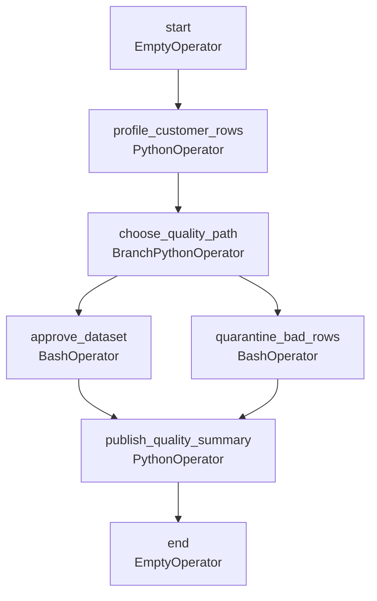

# DAG Documentation — `daily_data_quality_checks`

Generated at `2026-08-20T12:19:51+00:00` from `dags/daily_data_quality_checks.py`.

## `daily_data_quality_checks`

No description provided.

| Property | Value |
| --- | --- |
| Schedule | `0 0 * * *` |
| Start date | `2026-08-01T00:00:00+00:00` |
| End date | `Not set` |
| Catchup | `False` |
| Max active runs | `16` |
| Owner | `data-quality` |
| Tags | `example`, `operators`, `quality` |
| Task count | `7` |

### Task Graph

### Tasks

| Task ID | Operator | Owner | Retries | Trigger Rule | Pool | Downstream |
| --- | --- | --- | --- | --- | --- | --- |
| `approve_dataset` | `BashOperator` | `data-quality` | `1` | `all_success` | `default_pool` | `publish_quality_summary` |
| `choose_quality_path` | `BranchPythonOperator` | `data-quality` | `1` | `all_success` | `default_pool` | `approve_dataset`, `quarantine_bad_rows` |
| `end` | `EmptyOperator` | `data-quality` | `1` | `all_success` | `default_pool` | None |
| `profile_customer_rows` | `PythonOperator` | `data-quality` | `1` | `all_success` | `default_pool` | `choose_quality_path` |
| `publish_quality_summary` | `PythonOperator` | `data-quality` | `1` | `none_failed_min_one_success` | `default_pool` | `end` |
| `quarantine_bad_rows` | `BashOperator` | `data-quality` | `1` | `all_success` | `default_pool` | `publish_quality_summary` |
| `start` | `EmptyOperator` | `data-quality` | `1` | `all_success` | `default_pool` | `profile_customer_rows` |
