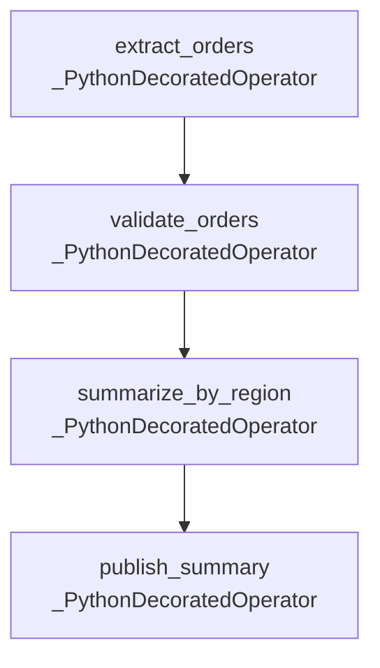

# DAG Documentation — `daily_sales_summary`

Generated at `2026-08-19T10:00:29+00:00` from `dags/daily_sales_summary.py`.

## `daily_sales_summary`

No description provided.

| Property | Value |
| --- | --- |
| Schedule | `0 0 * * *` |
| Start date | `2026-08-01T00:00:00+00:00` |
| End date | `Not set` |
| Catchup | `False` |
| Max active runs | `16` |
| Owner | `data-team` |
| Tags | `daily`, `example`, `sales` |
| Task count | `4` |

### Task Graph

### Tasks

| Task ID | Operator | Owner | Retries | Trigger Rule | Pool | Downstream |
| --- | --- | --- | --- | --- | --- | --- |
| `extract_orders` | `_PythonDecoratedOperator` | `data-team` | `2` | `all_success` | `default_pool` | `validate_orders` |
| `publish_summary` | `_PythonDecoratedOperator` | `data-team` | `2` | `all_success` | `default_pool` | None |
| `summarize_by_region` | `_PythonDecoratedOperator` | `data-team` | `2` | `all_success` | `default_pool` | `publish_summary` |
| `validate_orders` | `_PythonDecoratedOperator` | `data-team` | `2` | `all_success` | `default_pool` | `summarize_by_region` |
