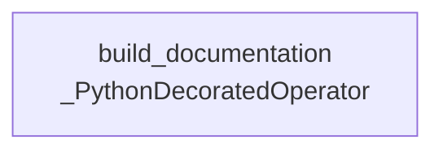

# DAG Documentation — `generate_dag_documentation`

Generated at `2026-08-19T09:50:51+00:00` from `dags/generate_dag_documentation.py`.

## `generate_dag_documentation`

Generate markdown documentation for all Airflow DAGs in this project.

| Property | Value |
| --- | --- |
| Schedule | `0 0 * * *` |
| Start date | `2026-08-15T18:30:00+00:00` |
| End date | `Not set` |
| Catchup | `False` |
| Max active runs | `16` |
| Owner | `airflow` |
| Tags | `automation`, `documentation` |
| Task count | `1` |

### Task Graph

### Tasks

| Task ID | Operator | Owner | Retries | Trigger Rule | Pool | Downstream |
| --- | --- | --- | --- | --- | --- | --- |
| `build_documentation` | `_PythonDecoratedOperator` | `airflow` | `0` | `all_success` | `default_pool` | None |
