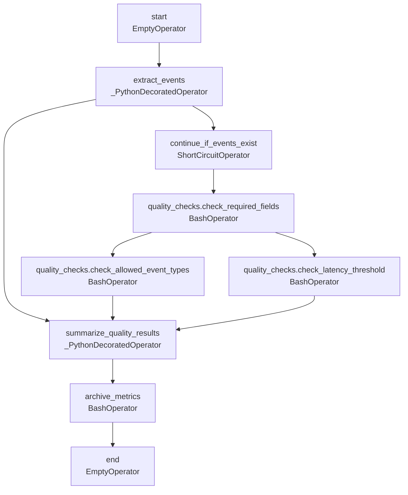

# DAG Documentation — `hourly_product_event_quality`

Generated at `2026-08-20T12:19:53+00:00` from `dags/hourly_product_event_quality.py`.

## `hourly_product_event_quality`

No description provided.

| Property | Value |
| --- | --- |
| Schedule | `0 * * * *` |
| Start date | `2026-08-01T00:00:00+00:00` |
| End date | `Not set` |
| Catchup | `False` |
| Max active runs | `16` |
| Owner | `product-analytics` |
| Tags | `events`, `example`, `quality` |
| Task count | `9` |

### Task Graph

### Tasks

| Task ID | Operator | Owner | Retries | Trigger Rule | Pool | Downstream |
| --- | --- | --- | --- | --- | --- | --- |
| `archive_metrics` | `BashOperator` | `product-analytics` | `1` | `all_success` | `default_pool` | `end` |
| `continue_if_events_exist` | `ShortCircuitOperator` | `product-analytics` | `1` | `all_success` | `default_pool` | `quality_checks.check_required_fields` |
| `end` | `EmptyOperator` | `product-analytics` | `1` | `all_success` | `default_pool` | None |
| `extract_events` | `_PythonDecoratedOperator` | `product-analytics` | `1` | `all_success` | `default_pool` | `continue_if_events_exist`, `summarize_quality_results` |
| `quality_checks.check_allowed_event_types` | `BashOperator` | `product-analytics` | `1` | `all_success` | `default_pool` | `summarize_quality_results` |
| `quality_checks.check_latency_threshold` | `BashOperator` | `product-analytics` | `1` | `all_success` | `default_pool` | `summarize_quality_results` |
| `quality_checks.check_required_fields` | `BashOperator` | `product-analytics` | `1` | `all_success` | `default_pool` | `quality_checks.check_allowed_event_types`, `quality_checks.check_latency_threshold` |
| `start` | `EmptyOperator` | `product-analytics` | `1` | `all_success` | `default_pool` | `extract_events` |
| `summarize_quality_results` | `_PythonDecoratedOperator` | `product-analytics` | `1` | `all_success` | `default_pool` | `archive_metrics` |
