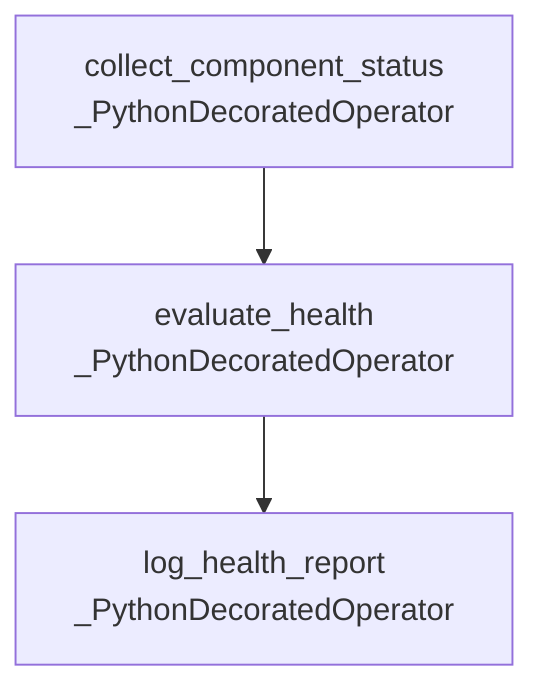

# DAG Documentation — `hourly_system_healthcheck`

Generated at `2026-08-19T09:50:53+00:00` from `dags/hourly_system_healthcheck.py`.

## `hourly_system_healthcheck`

No description provided.

| Property | Value |
| --- | --- |
| Schedule | `0 * * * *` |
| Start date | `2026-08-01T00:00:00+00:00` |
| End date | `Not set` |
| Catchup | `False` |
| Max active runs | `16` |
| Owner | `platform-team` |
| Tags | `example`, `hourly`, `monitoring` |
| Task count | `3` |

### Task Graph

### Tasks

| Task ID | Operator | Owner | Retries | Trigger Rule | Pool | Downstream |
| --- | --- | --- | --- | --- | --- | --- |
| `collect_component_status` | `_PythonDecoratedOperator` | `platform-team` | `1` | `all_success` | `default_pool` | `evaluate_health` |
| `evaluate_health` | `_PythonDecoratedOperator` | `platform-team` | `1` | `all_success` | `default_pool` | `log_health_report` |
| `log_health_report` | `_PythonDecoratedOperator` | `platform-team` | `1` | `all_success` | `default_pool` | None |
