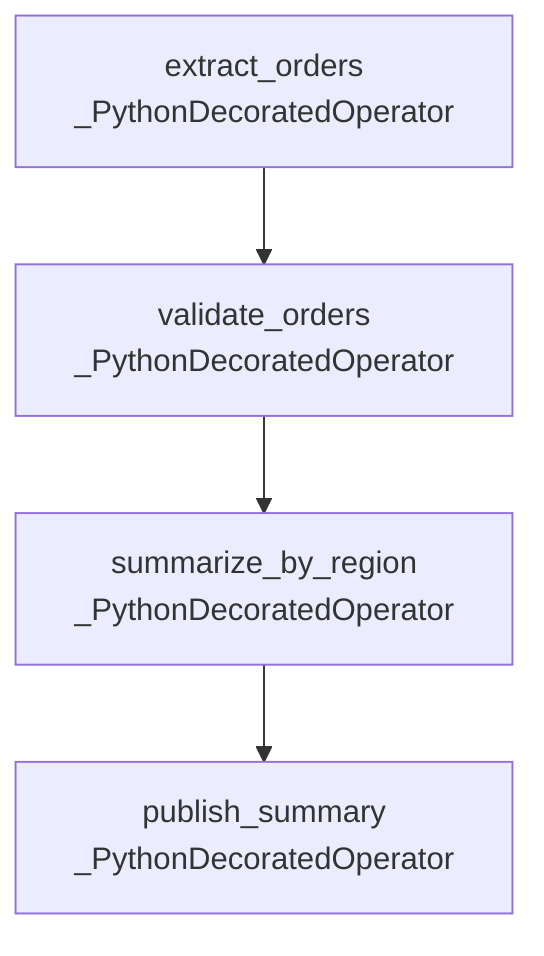

# airflow-docs-automate

Automatically generate markdown documentation for Apache Airflow DAGs using a Python script, Docker, and GitHub Actions CI/CD.

---

## Table of Contents

- [Overview](#overview)
- [Project Structure](#project-structure)
- [Requirements](#requirements)
- [Installation](#installation)
- [Usage](#usage)
  - [1. Local (Python)](#1-local-python)
  - [2. Docker Compose](#2-docker-compose)
  - [3. Docker Standalone](#3-docker-standalone)
- [CLI Arguments](#cli-arguments)
- [CI/CD — GitHub Actions](#cicd--github-actions)
- [How Documentation is Generated](#how-documentation-is-generated)
- [Output Format](#output-format)
- [Adding a New DAG](#adding-a-new-dag)
- [Security Notes](#security-notes)

---

## Overview

This project provides a fully automated pipeline to document Apache Airflow DAGs. It scans a DAG directory, loads all DAGs using Airflow's `DagBag`, extracts metadata, and renders a structured markdown file complete with Mermaid task-flow diagrams.

The documentation can be generated in three ways:

- **Locally** — run the Python script directly
- **Docker / Docker Compose** — containerized, no local Airflow install needed
- **GitHub Actions** — auto-generates and commits docs on every push or pull request

---

## Project Structure

```
airflow-docs-automate/
├── dags/                                    # Your Airflow DAG files (any number)
├── scripts/
│   └── generate_dag_docs.py                 # Core documentation generator script
├── Documentation/
│   └── documentation.md                     # Auto-generated markdown output
├── .github/
│   └── workflows/
│       └── generate-dag-documentation.yml   # GitHub Actions CI/CD workflow
├── .dockerignore
├── .gitignore
├── Dockerfile
├── docker-compose.yml
└── requirements.txt
```

---

## Requirements

| Requirement | Version |
| --- | --- |
| Python | 3.11+ |
| apache-airflow | 3.0.6 |
| Docker | Any recent version (optional) |

---

## Installation

### Python (local)

```bash
pip install apache-airflow==3.0.6
```

For a pinned, reproducible install using Airflow's official constraints:

```bash
AIRFLOW_VERSION=3.0.6
PYTHON_VERSION=$(python -c "import sys; print(f'{sys.version_info.major}.{sys.version_info.minor}')")
CONSTRAINT_URL="https://raw.githubusercontent.com/apache/airflow/constraints-${AIRFLOW_VERSION}/constraints-${PYTHON_VERSION}.txt"
pip install "apache-airflow==${AIRFLOW_VERSION}" --constraint "${CONSTRAINT_URL}"
```

### Docker

No local Python or Airflow installation needed. Just have Docker installed.

```bash
docker build -t airflow-docs .
```

---

## Usage

### 1. Local (Python)

```bash
python scripts/generate_dag_docs.py \
  --dags-dir dags \
  --output Documentation/documentation.md
```

With optional JSON summary output:

```bash
python scripts/generate_dag_docs.py \
  --dags-dir dags \
  --output Documentation/documentation.md \
  --json-output Documentation/summary.json
```

### 2. Docker Compose

```bash
docker compose up
```

This builds the image, runs the generator, and writes the output to `./Documentation/documentation.md` on your host machine via a volume mount.

The `docker-compose.yml` is configured as:

```yaml
services:
  dag-docs:
    build: .
    volumes:
      - ./Documentation:/opt/airflow/Documentation
    command:
      - python
      - /opt/airflow/scripts/generate_dag_docs.py
      - --dags-dir
      - /opt/airflow/dags
      - --output
      - /opt/airflow/Documentation/documentation.md
```

### 3. Docker Standalone

```bash
docker build -t airflow-docs .
docker run --rm -v "$(pwd)/Documentation:/opt/airflow/Documentation" airflow-docs
```

---

## CLI Arguments

| Argument | Default | Description |
| --- | --- | --- |
| `--dags-dir` | `dags` | Path to the directory containing DAG files |
| `--output` | `Documentation/documentation.md` | Output markdown file path |
| `--json-output` | _(none)_ | Optional path to write a JSON summary file |

---

## CI/CD — GitHub Actions

The workflow is defined at `.github/workflows/generate-dag-documentation.yml`.

### Triggers

| Event | Behavior |
| --- | --- |
| Push to `main` or `master` | Generates docs and commits them back to the branch |
| Pull request | Generates docs and uploads as an artifact (no commit) |
| `workflow_dispatch` | Manual trigger from the GitHub Actions UI |

### Workflow Steps

1. **Checkout** — checks out the repository
2. **Set up Python 3.11** — using `actions/setup-python@v5`
3. **Install Airflow** — installs `apache-airflow==3.0.6` with official constraints
4. **Generate documentation** — runs `scripts/generate_dag_docs.py`
5. **Upload artifact** — uploads `Documentation/documentation.md` as `dag-documentation`
6. **Commit & push** _(push events only)_ — if the file changed, commits with message `Update DAG documentation [skip ci]` and pushes back to the branch

### Required Permissions

The workflow requires `contents: write` permission to commit and push the generated documentation.

---

## How Documentation is Generated

The script `scripts/generate_dag_docs.py` works as follows:

1. **Load DAGs** — uses Airflow's `DagBag` with `include_examples=False` and `safe_mode=False` to load all DAGs from the specified directory
2. **Collect DAG details** — for each DAG, extracts:
   - `dag_id`, description, schedule, start/end date, catchup, max active runs, owner, tags, task count
3. **Collect task details** — for each task in a DAG, extracts:
   - `task_id`, operator class name, owner, retries, trigger rule, pool, downstream task IDs, task documentation (`doc_md` or `doc`)
4. **Render Mermaid diagrams** — builds a `flowchart TD` diagram showing task execution order based on downstream dependencies
5. **Render markdown** — assembles the full markdown document with a summary table, import errors section, and a section per DAG
6. **Write output** — writes the markdown to the specified `--output` path; optionally writes a JSON summary to `--json-output`

### Key Functions

| Function | Description |
| --- | --- |
| `load_dagbag(dags_dir)` | Loads all DAGs using Airflow's `DagBag` |
| `collect_dag_details(dag)` | Extracts all metadata from a single DAG object |
| `render_dag_section(dag_info)` | Renders the markdown section for one DAG |
| `render_task_graph(dag_info)` | Renders the Mermaid flowchart for a DAG's tasks |
| `render_markdown(dags, import_errors, dags_dir)` | Assembles the full markdown document |
| `generate_documentation(dags_dir, output_path, json_output_path)` | Orchestrates the full generation pipeline |
| `write_json_summary(dags, import_errors, output_path)` | Writes an optional JSON summary file |

---

## Output Format

The generated `Documentation/documentation.md` contains:

1. **Header** — title and generation timestamp with source directory
2. **Summary table** — total DAG count, import error count, total task count
3. **Import Errors** — table of any DAGs that failed to load, with file path and error message
4. **Per-DAG sections**, each containing:
   - Description
   - Properties table (schedule, start date, end date, catchup, max active runs, owner, tags, task count)
   - Mermaid `flowchart TD` task graph
   - Tasks table (task ID, operator, owner, retries, trigger rule, pool, downstream tasks)
   - Task documentation block (if `doc_md` or `doc` is set on any task)

### Example Summary Table

```markdown
| Metric             | Value |
| ---                | ---   |
| DAG count          | `4`   |
| Import error count | `0`   |
| Total task count   | `12`  |
```

### Example Mermaid Task Graph



---

## Adding a New DAG

1. Drop your `.py` DAG file into the `dags/` directory
2. Run the generator using any of the three methods above, or simply push to `main`/`master`
3. The new DAG will automatically appear in `Documentation/documentation.md`

No configuration changes are needed — the script discovers all DAGs dynamically via `DagBag`.

---

## Security Notes

- `apache-airflow==3.0.6` has a known vulnerability (CVE related to Variable response masker bypass for deeply nested JSON values). It is recommended to upgrade to `apache-airflow>=3.2.2` when possible.
- The GitHub Actions workflow uses `contents: write` permission — scope this carefully in shared repositories.
- Avoid storing sensitive values in DAG Variables with deeply nested JSON structures until the Airflow version is upgraded.
